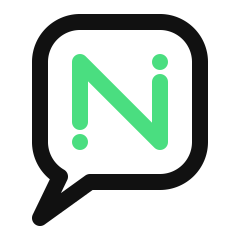
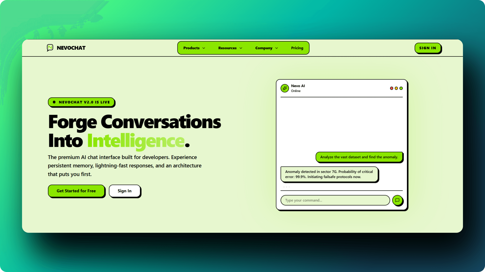

<div align="center">
  
</div>

<h1 align="center">NevoChat</h1>

<p align="center">
  <strong>Chat with all open-source LLMs in one place. The ultimate real-time AI hub designed for seamless interaction, beautiful aesthetics, and unmatched performance.</strong>
</p>

<div align="center">
  
</div>

<br />

## 🚀 Features

- **Real-time AI Chat**: Powered by Vercel AI SDK and OpenRouter API for streaming responses.
- **Beautiful UI/UX**: Crafted with Tailwind CSS, Shadcn UI, and Framer Motion for smooth animations.
- **Authentication**: Secure and seamless authentication using Better Auth.
- **Persistent Storage**: Chat history and user data stored securely via Prisma ORM and PostgreSQL.
- **Rich Text Support**: Full support for rendering markdown, code blocks (with syntax highlighting), math equations, and flowcharts.
- **Responsive Design**: Carefully optimized to look great and work perfectly on both desktop and mobile.

## 🛠️ Tech Stack

### Frontend

- **Framework**: [Next.js](https://nextjs.org/) (15+ App Router)
- **Styling**: [Tailwind CSS](https://tailwindcss.com/)
- **UI Components**: [Shadcn UI](https://ui.shadcn.com/) & [Radix UI](https://www.radix-ui.com/)
- **Animations**: [Framer Motion](https://www.framer.com/motion/)
- **State Management**: [Zustand](https://zustand-demo.pmnd.rs/) & React Query

### Backend & AI

- **Database**: PostgreSQL with [Prisma ORM](https://www.prisma.io/)
- **Authentication**: [Better Auth](https://www.better-auth.com/)
- **AI Integration**: [ai-sdk.dev](https://sdk.vercel.ai/)

## 💻 Getting Started

### Prerequisites

Ensure you have Node.js (v18+) and `pnpm` installed.

### 1. Clone the repository

```bash
git clone https://github.com/seekernothing/nevochat.git
cd nevochat
```

### 2. Install dependencies

```bash
pnpm install
```

### 3. Setup Environment Variables

Create a `.env` file in the root directory and add the following variables:

```env
# Database URL (PostgreSQL)
DATABASE_URL="your_postgresql_database_url"

# Authentication (Better Auth)
BETTER_AUTH_SECRET="your_random_secret_string"
BETTER_AUTH_URL="http://localhost:3000"

# OpenRouter (or another AI provider)
OPENROUTER_API_KEY="your_openrouter_api_key"
```

### 4. Push Database Schema

```bash
npx prisma db push
```

### 5. Run the Development Server

```bash
pnpm dev
```

Open [http://localhost:3000](http://localhost:3000) with your browser to see the application running.

## 🤝 Contributing

Contributions, issues, and feature requests are welcome! Feel free to check the [issues page](https://github.com/seekernothing/nevochat/issues).

## 📄 License

This project is licensed under the MIT License - see the LICENSE file for details.
